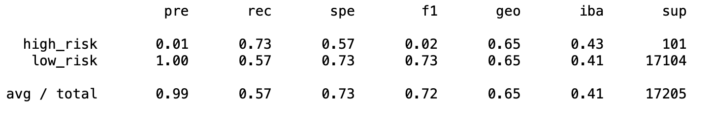

# Credit_Risk_Analysis
## Overview
In this project, we extract the credit card credit dataset from LendingClub, then predict credit card risk by using Resampling Models, SMOTEENN Algorithm and ensemble Classifiers. In addition, we are oversampling the data using the RansomOverSampler and SMOTE Algorithm, under sampling the data using the ClusterCentroids Algorithm. Then, we will use SMOTEENN Algorithm to preform both over- and under sampling approach. Lastly, we compare the BalanceRandomForestClassifier model with the EasyEnsembleClassifier models to reduce bias and predict credit risk.

## Results
### Naive Random Oversampling
The precision for high_risk is low, which indicating an overfitting for the low_risk. Also, the recall score stands for the sensitivity that for both cases, the scores are not ideal. 
- Balance Accuracy Score: 0.640
- Precision Score: 0.01
- Recall Score: 0.66
  
  Naive Random Oversampling Imbalanced Classification Report
### SMOTE Oversampling
The precision for high_risk is low, which indicating an overfitting for the low_risk. Also, the recall score stands for the sensitivity that for both cases, the scores are not ideal and lower than the accuracy score. 
- Balance Accuracy Score: 0.630
- Precision Score: 0.01
- Recall Score: 0.58
  
   SMOTE Oversampling Imbalanced Classification Report

### Undersampling
The precision for high_risk is low, which indicating an overfitting for the low_risk. Also, the recall score stands for the sensitivity that for both cases, the scores are not ideal and lower than the accuracy score.
- Balance Accuracy Score: 0.630
- Precision Score: 0.01
- Recall Score: 0.62
  
  Undersampling Imbalanced Classification Report

### Combination (Over and Under) Sampling—SMOTEENN
The precision for high_risk is low, which indicating an overfitting for the low_risk. Also, the recall score stands for the sensitivity that for both cases, the scores are not ideal.
- Balance Accuracy Score: 0.575
- Precision Score: 0.01
- Recall Score: 0.73
  
  Combination (Over and Under) Sampling—SMOTEENN Imbalanced Classification Report

### Balanced Random Forest Classifier
The precision for high_risk is low, which indicating an overfitting for the low_risk. Also, the recall score stands for the sensitivity that for both cases, the scores are somewhat ideal. The scores have a better performance than the over- and undersampling models since it is over 0.70.
- Balance Accuracy Score: 0.789
- Precision Score: 0.03
- Recall Score: 0.70
  
  Balanced Random Forest Classifier Imbalanced Classification Report

### Easy Ensemble AdaBoost Classifier
The Balance Accuracy Score is fairly high and above the Recall Score. With high Recall Score, which indicating that the algorithm returns most of the relevant results. 
- Balance Accuracy Score: 0.935
- Precision Score: 0.10
- Recall Score: 0.92
  
   Easy Ensemble AdaBoost Classifier Imbalanced Classification Report

## Summary
From the analysis above, I would recommend the Easy Ensemble AdaBoost Classifier first, and Balanced Random Forest Classifier. All the over- and under sampling models are not recommended, because all those models have the Balance Accuracy Scores less than 0.70. Also, those models’ Imbalanced Classification Report presents bad scores. The Easy Ensemble AdaBoost Classifier combines multiple low accuracy models to create a high accuracy model, so that it is recommended for credit risk analysis.